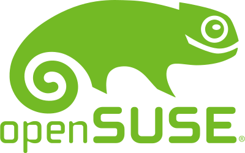

# Información para el cartel o para el programa

## Título del evento

**Celebrando openSUSE Leap 15.1: jornada sobre Linux y Software Libre**

## Logo principal

El logo principal a mostrar debería ser el de openSUSE

## Programa

En el salón de actos

* 9:00 Presentación
* 9:45 Haciendo carrera con el software libre, experiencias de
primera mano

En el aulario

* A las 11:00
  * Curso acelerado para la nube: introducción y administración automatizada
  * Virtualización en Linux para videojuegos y otros muchos usos
  * Tutorial rápido de Ruby on Rails
  * Control de versiones con Git

* A las 12:00
  * Curso acelerado para la nube: configurando 100s de máquinas con Ansible
  * Gestión de configuraciones con SaltStack
  * Integración continua a lo grande: openSUSE Tumbleweed
  * La importancia del Software Libre en la Salud Pública

* A partir de las 13:00
  * Instalación asistida de openSUSE para todos
  * Consultorio de Linux y Software Libre

## Ponentes

No creo que haga falta detallarlos. Sólo poner los logos de las organizaciones.
Algo así como...

_Con ponentes de:_

| Gnu Health | SUSE | Red Hat    |
|------------|------|------------|
|  |  |  |
